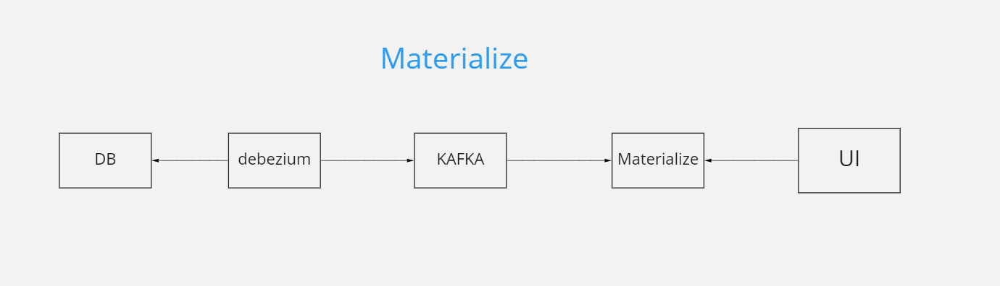

# spring-debezium-kafka-materialized-views

Debezium, a platform commonly used for CDC.  

## Change Data Capture (CDC) is a technique and a design pattern. We often use it to replicate data between databases in real-time.

## Conception

## To start the project

(this spring boot application is connected to materialized)
after following the steps below, you can start the application. and query materialized views with
spring data jpa

1. clone project from github and go to the project folder.
2. run docker-compose.yml -d up.
3. Create a database and a table ,and insert some data. you can check create_source.sql file
4. setup postgresql debezium connector (run config_Debez_postgresql.cmd)  and kafka to materialize
   is connected automatically
5. uncomment the mzcli service and run docker-compose run mzcli
6. create source in materialize ( you can check create_source.sql file )
7. Create Materialize view

   
